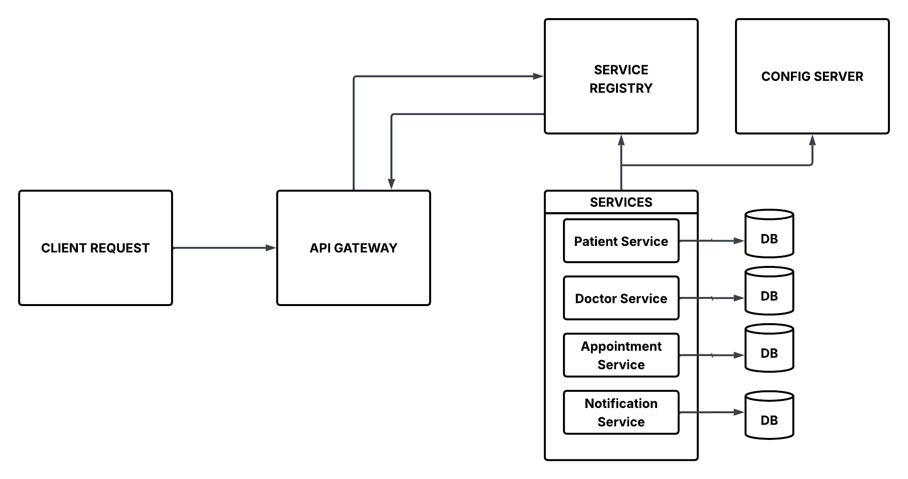

# 🏥 Healthcare Appointment Booking – Microservices with Spring Boot 3

## Overview

This project showcases a microservices architecture for healthcare appointment booking, enabling patients to schedule appointments with doctors. It leverages modern, production-ready technologies including Spring Boot, Spring Cloud, Kafka, Docker, and Zipkin.

---

## Architecture

- **Config Server:** Centralized configuration management (Git-backed)
- **Service Registry (Eureka):** Service discovery
- **API Gateway:** Single entry point, authentication, routing
- **Patient Service:** Manages patient profiles
- **Doctor Service:** Manages doctors and schedules
- **Appointment Service:** Orchestrates bookings (validates patient & doctor, stores appointment)
- **Notification Service:** Listens to appointment events (via Kafka) and sends notifications
- **Kafka:** Event bus for asynchronous communication
- **Zipkin & Micrometer:** Distributed tracing & monitoring
- **H2:** Dedicated in-memory(development) database per service

---

## System Diagram


---

## Project Structure

```
healthcare-booking/
 ├── api-gateway/
 ├── service-registry/
 ├── config-server/
 ├── patient-service/
 ├── doctor-service/
 ├── appointment-service/
 ├── notification-service/
 └── README.md
```

---

## Features

- ✅ Service discovery with Eureka
- ✅ Centralized config with Spring Cloud Config
- ✅ Routing & security with API Gateway
- ✅ Async communication with Kafka
- ✅ Distributed tracing with Zipkin
- ✅ Per-service database (microservice DB pattern)
- ✅ Event-driven notifications

---

## Tech Stack

- **Java 17**
- **Spring Boot**
- **Spring Cloud**
- **Spring Data JPA / Hibernate**
- **Kafka**
- **In-memory database(H2)**
- **Zipkin, Micrometer, Prometheus**
